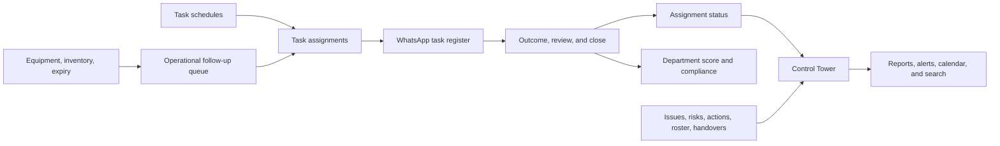

# Hospital Operations System: Connectivity Map and Remaining Gaps

## Purpose

This document explains how each manager-facing section currently exchanges operational data with the rest of the system. It also distinguishes **implemented connections** from **manual hand-offs, partial integrations, and work that is not yet connected**. The application is designed as a manager-led system: WhatsApp communication is recorded manually rather than sent automatically by the application.

## Core operating flow

## Section-by-section connections

| Section                                    | Primary records                                                                                                          | Connected to                                                               | How the connection works                                                                                                                                                                 | Status                                               |
| ------------------------------------------ | ------------------------------------------------------------------------------------------------------------------------ | -------------------------------------------------------------------------- | ---------------------------------------------------------------------------------------------------------------------------------------------------------------------------------------- | ---------------------------------------------------- |
| **Control Tower**                          | Task assignments, WhatsApp dispatches, issues, equipment, inventory, staffing targets, roster, handovers, risks, actions | WhatsApp register, Issues, Equipment, Inventory, Roster, Handover, Reports | Consolidates operational attention signals and active task counts. Its workflow table now uses the same current-day Daily, Weekly, and Monthly assignments as the WhatsApp register.     | **Connected**                                        |
| **Task schedules**                         | Tasks, recurring-task schedules, task assignments                                                                        | WhatsApp register, Control Tower, Calendar                                 | A scheduled Daily, Weekly, or Monthly task creates an assignment. Current-day assignments appear in the WhatsApp register and the Control Tower workflow table.                          | **Connected**                                        |
| **WhatsApp task register**                 | Task assignments, WhatsApp dispatches, lifecycle events, score events                                                    | Control Tower, Reports, Scoring Rules, Alerts                              | Managers prepare, copy, confirm send, acknowledge, record an outcome, review, and close. Outcomes update the underlying assignment and, where applicable, the department score.          | **Connected**                                        |
| **Direct manager completion**              | Task assignment, task completion, audit record                                                                           | WhatsApp register, Control Tower                                           | A manager can complete eligible work personally. This creates no WhatsApp dispatch and no department-point deduction. The completed task is excluded from “still to distribute.”         | **Connected**                                        |
| **Scoring rules and department scorecard** | Scoring rules, point events, WhatsApp dispatches                                                                         | WhatsApp register, Control Tower, Reports                                  | Pending and no-reply outcomes apply a configured priority deduction once. Excused outcomes require a reason and do not deduct points.                                                    | **Connected**                                        |
| **Issues**                                 | Issue, comments, audit records                                                                                           | Control Tower, Alerts, Reports, Search                                     | Checklist findings can create issues. Open and high-priority issues affect Control Tower status, appear in alerts, and are included in repeated-problem reporting.                       | **Connected**                                        |
| **Equipment, inventory, and expiry**       | Equipment, maintenance, inventory, expiry records                                                                        | Control Tower, Follow-up Queue, Calendar, Search                           | Equipment readiness, stock-outs, low stock, and expiry conditions appear on the Control Tower. Managers may create a linked follow-up task from equipment, inventory, or expiry records. | **Connected with manual follow-up creation**         |
| **Operational follow-up queue**            | One-time task and assignment created from source record                                                                  | Control Tower, Calendar, Search                                            | A manager-confirmed action turns a concerning equipment, inventory, or expiry record into a high-priority one-time assignment.                                                           | **Connected one-way**                                |
| **Risk register**                          | Risk, risk score, review date, linked IDs                                                                                | Control Tower, Calendar, Search, Management Actions                        | Open risks contribute to operational awareness. Their review dates appear in the calendar; risks can reference related issues or tasks.                                                  | **Connected, but linking is mainly manager-entered** |
| **Management actions**                     | Action, owner, priority, due date, verification, linked IDs                                                              | Control Tower, Calendar, Search, Risks, Issues                             | Overdue actions affect the Control Tower. Their deadlines appear in the calendar, and actions may record related issues, risks, or tasks.                                                | **Connected, but linking is mainly manager-entered** |
| **Roster and attendance**                  | Duty roster, attendance status, staffing targets                                                                         | Control Tower, Alerts, Calendar, Handover                                  | Staffing targets and attendance determine coverage shortfalls. Absence or leave creates a replacement-needed alert; roster shifts appear in the calendar.                                | **Connected**                                        |
| **Handover**                               | Shift handover, unresolved notes                                                                                         | Control Tower, Roster, Alerts                                              | Unresolved handovers create a Control Tower attention item. The roster shows a handover status per department.                                                                           | **Connected**                                        |
| **Calendar**                               | Task assignments, maintenance, expiry, duties, risk reviews, action deadlines                                            | Tasks, Equipment, Inventory, Roster, Risks, Actions                        | Provides a dated, filterable read model across operational schedules and due dates.                                                                                                      | **Connected read model**                             |
| **Search**                                 | Search index assembled from operational records                                                                          | Tasks, Issues, Risks, Actions, Equipment, Inventory                        | Finds records across modules and routes managers to the relevant workspace.                                                                                                              | **Connected discovery tool**                         |
| **Alerts**                                 | Notifications                                                                                                            | Tasks, Issues, Roster, Control Tower                                       | Overdue tasks, escalated issues, and attendance exceptions produce in-app alert records. Control Tower also shows recent alerts.                                                         | **Connected, in-app only**                           |
| **Reports**                                | Dashboard aggregates, WhatsApp timing, department points, issue categories                                               | Control Tower, WhatsApp register, Issues, Roster                           | Shows compliance, response time, department comparison, point losses, and repeated-problem trends.                                                                                       | **Connected read model**                             |
| **Operations setup and roles**             | Departments, escalation rules, notification rules, roles                                                                 | All manager workspaces                                                     | Department records support ownership across modules; configuration controls task escalation, scoring, and notification behavior.                                                         | **Foundational connection**                          |

## Important workflow rules

> **WhatsApp-managed department tasks and manager-owned tasks are different paths.** Department tasks can follow the manual WhatsApp lifecycle. Work completed directly by the operations manager is recorded as manager-owned, never sent to WhatsApp, and does not affect departmental scoring.

> **The Control Tower workflow table and WhatsApp register now share the same current-day Daily, Weekly, and Monthly task scope.** The broader “Active task queue” metric intentionally also includes unresolved older assignments and one-time operational follow-ups.

| Workflow                             | Start                                       | End                            | System effect                                                                                |
| ------------------------------------ | ------------------------------------------- | ------------------------------ | -------------------------------------------------------------------------------------------- |
| Department WhatsApp task             | Current-day scheduled assignment            | Closed WhatsApp lifecycle      | Assignment state, department compliance, point score, reports, Control Tower workflow status |
| Manager-owned task                   | Current-day scheduled assignment            | Direct manager completion      | Assignment completion and audit trail; no dispatch, score, or department reply requirement   |
| Equipment/inventory/expiry follow-up | Manager confirms source record needs action | Follow-up task completed       | Creates a one-time task and makes it visible in operational work views                       |
| Issue escalation                     | Issue is created or assigned                | Resolved or closed             | Control Tower attention, alerts, reports, and audit history                                  |
| Roster exception                     | Attendance is absent or leave               | Coverage is corrected manually | Replacement alert, roster availability status, Control Tower staffing signal                 |

## Remaining integration gaps and intentionally manual areas

| Priority | Gap or limitation                                                                         | Current behavior                                                                                                                             | Impact                                                                                                               | Suggested next improvement                                                                                                               |
| -------- | ----------------------------------------------------------------------------------------- | -------------------------------------------------------------------------------------------------------------------------------------------- | -------------------------------------------------------------------------------------------------------------------- | ---------------------------------------------------------------------------------------------------------------------------------------- |
| High     | **No actual WhatsApp sending or delivery receipt**                                        | The system prepares and records a message, but the manager copies it and sends it outside the system.                                        | The app cannot prove delivery, group membership, or message-read status.                                             | Add an approved WhatsApp Business integration only if you want automation; otherwise retain the manual confirmation control.             |
| High     | **Follow-up tasks do not close the source record automatically**                          | Completing a follow-up task does not update the originating inventory, expiry, or equipment record.                                          | A source item can still look unresolved after the task is done.                                                      | Add a manager confirmation step that updates the linked source status when the follow-up is closed.                                      |
| High     | **Issue, risk, action, and task links are not automatically orchestrated**                | Related IDs can be stored, but managers generally create and link records manually.                                                          | A resolved issue does not automatically close a linked risk or management action.                                    | Add explicit “create linked risk/action” actions and a closure-reconciliation prompt.                                                    |
| Medium   | **Roster creation/import is not yet available in the manager workspace**                  | The roster can display attendance and update an existing entry, but a blank day requires data to be added outside the visible roster screen. | Managers cannot complete the full roster setup flow in one place.                                                    | Add a roster creation form and CSV import for daily shifts.                                                                              |
| Medium   | **Alerts have no acknowledgement or closure state**                                       | Alerts are listed as recent records and remain historical messages.                                                                          | Managers cannot distinguish new, acknowledged, and resolved alerts.                                                  | Add alert acknowledgement, assignment, and dismissal-with-reason controls.                                                               |
| Medium   | **Calendar is a read-only schedule view**                                                 | It aggregates dates across modules but does not currently provide full record editing or deep linking from every event.                      | Managers must navigate separately to act on a calendar item.                                                         | Add event click-through to record detail and optional quick actions.                                                                     |
| Medium   | **Report time bases differ by measure**                                                   | Task readiness uses current work plus unresolved carry-over; score and WhatsApp accountability are month-oriented.                           | Counts may look different across a daily operational view and a monthly meeting view.                                | Add a visible time-basis label and date-range filters to reports.                                                                        |
| Medium   | **Department-head scope is not tightly restricted by department in every manager module** | Manager roles can access hospital-wide manager workspaces.                                                                                   | A department head may see or act on broader operational information than a strict department-only model would allow. | Decide whether department heads should be hospital-wide reviewers or restricted to their assigned department, then enforce consistently. |
| Low      | **One-time follow-ups are not WhatsApp-distributed by default**                           | They appear as operational assignments but are separate from the recurring Daily/Weekly/Monthly WhatsApp workflow.                           | This is intentional for manager-confirmed operational work, but it can be confusing without the label.               | Keep the separation or add an explicit “send follow-up to WhatsApp” choice.                                                              |
| Low      | **Legacy My Day and task-detail code remains as technical debt**                          | User-facing legacy URLs redirect to the manager task register, but some older internal components remain in the codebase.                    | No current manager-facing workflow impact, but it adds maintenance complexity.                                       | Retire unused legacy components after a separate regression review.                                                                      |

## Recommended implementation order

1. Add **roster creation/import** and **alert acknowledgement** because both reduce day-to-day manual tracking outside the application.
2. Add **linked-source closure** for equipment, inventory, expiry, issues, risks, and actions so follow-up work creates a complete audit trail.
3. Decide and enforce the intended **department-head visibility model** before adding more delegation features.
4. Consider WhatsApp Business automation only after the manual operating process is stable and the hospital has approved the messaging, privacy, and governance model.

## Validation baseline

The current build contains **66 automated tests across 15 test files**, including Control Tower and WhatsApp task-register parity coverage. TypeScript validation is clean, and the synchronized manager workflow has been reviewed at desktop and mobile widths.
